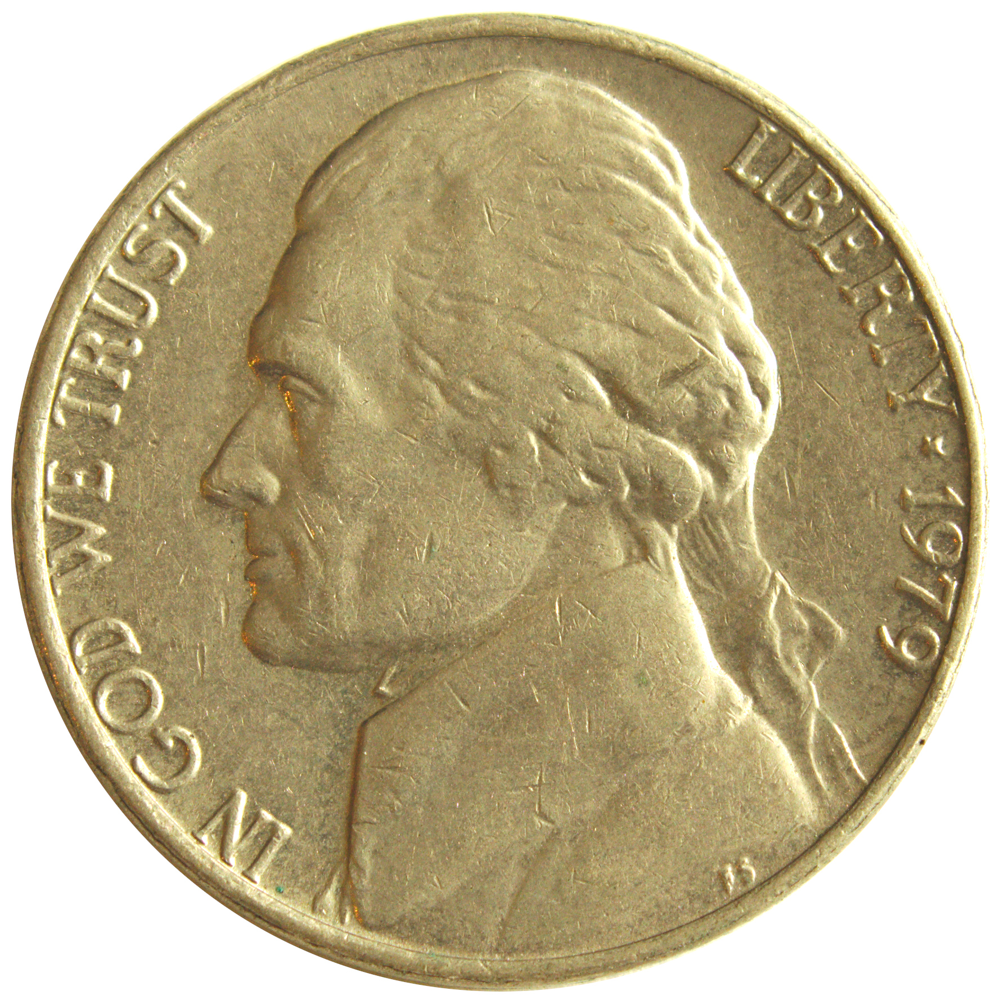

= Nickle Tutorial
Robert Burgess; Keith Packard
:title-logo-image: 
:doctype: book
:sectnums:
:toc: left
:icons: font
:experimental:

== Nickle Tour

The following is an example Nickle session, interspersed with comments. 

:leveloffset: 2

include::tour/tour.adoc[]

:leveloffset: 0

== Nickle Basics

Nickle is a powerful desktop calculator language with many features of
advanced languages and support for arbitrary precision numbers.  It
can run interactively to fulfill its role as a calculator, evaluate
single expressions, and execute Nickle scripts.  It also has an array
of useful top-level commands for interacting with the interpreter.

:leveloffset: 2

include::basics/invoke.adoc[]

include::basics/command.adoc[]

:leveloffset: 0

== Language introduction

In this chapter, the features of Nickle such as datatypes,
expressions, control statements, and functions will be discussed.  By
the end, most of the basic language features will have been covered.

:leveloffset: 2

include::intro/variables.adoc[]

include::intro/expressions.adoc[]

include::intro/statements.adoc[]

include::intro/functions.adoc[]

:leveloffset: 0

== Builtins

This chapter will explain various important builtin functions of
Nickle, such as those for input and output and math.  It will also
discuss the various operators and builtin functions that manipulate
strings.

:leveloffset: 2

include::builtins/io.adoc[]

include::builtins/math.adoc[]

include::builtins/strings.adoc[]

:leveloffset: 0

== Advanced topics

This chapter will discuss more advanced topics; these features make
Nickle as powerful as it is.  The semantics of copying and garbage
collection, namespaces, exceptions, threading and mutual exclusion,
and continuations will all be covered.

:leveloffset: 2

include::advanced/copying.adoc[]

include::advanced/namespaces.adoc[]

include::advanced/exceptions.adoc[]

include::advanced/concurrency.adoc[]

include::advanced/continuations.adoc[]

:leveloffset: 0
